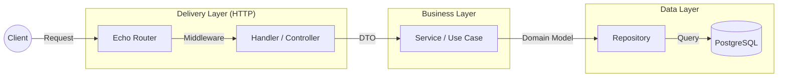

# Go Echo Boilerplate


[](LICENSE)

A production-ready, clean-architecture boilerplate for building robust, scalable REST APIs using Golang and the Echo framework.

## 🚀 Features

- **Web Framework**: [Echo v4](https://echo.labstack.com/) - High performance, extensible, minimalist Go web framework.
- **Clean Architecture**: Domain-driven design isolating `monitor`, `repository`, `service`, and `delivery` layers.
- **Database**: PostgreSQL with [GORM](https://gorm.io/) ORM and [Goose](https://github.com/pressly/goose) for migrations.
- **Authentication**: Secure JWT implementation with Access and Refresh tokens.
- **Configuration**: Environment-based configuration using [Viper](https://github.com/spf13/viper).
- **Structured Logging**: Context-aware canonical logging for better observability using [Zap](https://github.com/uber-go/zap).
- **Development Experience**: Hot-reload with [Air](https://github.com/air-verse/air) and comprehensive [Makefile](Makefile).
- **Containerization**: Docker and Docker Compose setup for consistent environments.
- **Documentation**: Auto-generated Swagger API documentation.
- **Testing**: Setup for unit and integration testing with mocks and coverage reports.
- **Nullable Fields**: Full support for optional JSON fields (mapped to SQL NULL via pointer types).

## 🏛️ Architecture

The project follows **Clean Architecture** principles to ensure separation of concerns, testability, and maintainability.



### Design Philosophy

- **Clean Architecture**: Dependencies point inwards. The core business logic (`service`) is independent of the delivery mechanism (`http`) and data source (`repository`).
- **Wide Events Logging**: Instead of scattered log lines, we emit one "canonical" log line per request containing all rich context (user, business data, errors).
- **Type Safety**: Heavy usage of strong typing, custom types for context keys, and compile-time checks where possible.
- **Configuration as Code**: All configuration is structurally defined and validated on startup.

## 🛠️ Tech Stack

- **[Echo v4](https://echo.labstack.com/)**: High performance, extensible, minimalist Go web framework.
- **[GORM](https://gorm.io/)**: The fantastic ORM library for Go, developer friendly.
- **[Goose](https://github.com/pressly/goose)**: Robust database migration tool.
- **[Viper](https://github.com/spf13/viper)**: Go configuration with fangs (handles ENV, YAML, flags).
- **[Air](https://github.com/air-verse/air)**: Live reload for Go apps during development.
- **[Zap](https://github.com/uber-go/zap)**: Blazing fast, structured, leveled logging.
- **[Validator](https://github.com/go-playground/validator)**: Value validations for structs and individual fields.
- **[Swag](https://github.com/swaggo/swag)**: Automatically generate RESTful API documentation with Swagger 2.0.

## 📂 Project Structure

```
.
├── cmd/
│   └── http/           # Application entry point (main.go)
├── config/             # Environment-specific configuration files (YAML)
├── docs/               # Detailed documentation, guides, and Swagger docs
├── internal/
│   ├── config/         # Configuration loading and validation logic
│   ├── deliveries/     # Interface adapters (HTTP Handlers, Middleware, Routes)
│   ├── models/         # Domain entities and Data Transfer Objects (DTOs)
│   ├── pkg/            # Shared libraries (JWT, Logger, Validator, Utils)
│   ├── repository/     # Data access logic (PostgreSQL implementation)
│   └── service/        # Business logic and use cases
├── migration/          # Database migration SQL files
└── docker-compose.yml  # Local development infrastructure (App, DB)
```

## 🏁 Getting Started

### Prerequisites

- Go 1.24+
- Docker & Docker Compose
- Make

### Installation

1.  **Clone the repository:**

    ```bash
    git clone https://github.com/yourusername/go-echo-boilerplate.git
    cd go-echo-boilerplate
    ```

2.  **Install development tools:**

    ```bash
    make install-tools
    ```

    This installs `air`, `golangci-lint`, `swag`, `goose`, and `gosec`.

3.  **Setup Configuration:**
    Ensure you have the necessary config files in `config/`:
    - `config.local.yaml` (for local runs)
    - `config.dev.yaml` (for Docker/dev runs)

4.  **Start Infrastructure:**

    ```bash
    make docker-up
    ```

5.  **Run Migrations:**

    ```bash
    make migrate-up ENV=dev
    ```

    _Note: The Makefile automatically loads environment variables from `.env` (if present) before running migrations._

6.  **Start Development Server:**
    ```bash
    make dev
    ```
    The server will start at `http://localhost:8080` (or configured port) with hot-reload enabled.

## 📜 Documentation

Detailed documentation is available in the `docs/` directory:

- **[Makefile Guide](docs/markdowns/MAKEFILE_GUIDE.md)**: Reference for all available make commands.
- **[JWT Usage](docs/markdowns/JWT_USAGE.md)**: Guide on token generation, validation, and rotation.
- **[Logging Guide](docs/markdowns/LOGGING.md)**: Explanation of the canonical logging pattern.
- **[Credential Masking](docs/markdowns/CREDENTIAL_MASKING.md)**: Handling sensitive data securely.
- **[Wide Events](docs/markdowns/WIDE_EVENTS.md)**: Advanced observability concepts.

## 🧪 Testing

Run specific test suites or all tests:

```bash
# Run all tests
make test

# Run tests with coverage report
make test-coverage
```

## 🐳 Docker Support

Run the application fully containerized:

```bash
# Start App and DB
make docker-up

# View Logs
make docker-logs

# Stop containers
make docker-down
```

## 🔐 Authentication Flow

The service uses a Dual-Token authentication scheme:

1.  **Access Token**: Short-lived (default 15m). Used for API access.
2.  **Refresh Token**: Long-lived (default 7d). Used to obtain new Access Tokens.

Refer to [JWT Usage Guide](docs/markdowns/JWT_USAGE.md) for implementation details.

## 🤝 Contributing

1.  Fork the Project
2.  Create your Feature Branch (`git checkout -b feature/AmazingFeature`)
3.  Commit your Changes (`git commit -m 'Add some AmazingFeature'`)
4.  Push to the Branch (`git push origin feature/AmazingFeature`)
5.  Open a Pull Request

## 📄 License

Distributed under the MIT License. See `LICENSE` for more information.

## Reference

- [Logging Sucks](https://loggingsucks.com/)

## Future Implementation

- [ ] Add tracing
- [ ] Add rate limiter
- [ ] Add circuit breaker
- [ ] Add metrics
- [ ] Add monitoring
- [ ] Add alerting
- [ ] Add tracing
